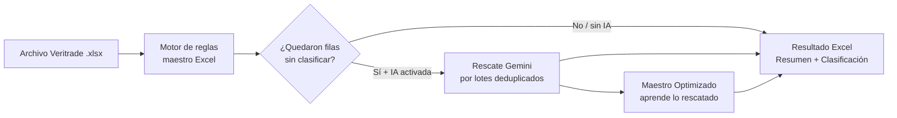

# 🗂️ Clasificador de Importaciones — Veritrade

Herramienta que clasifica automáticamente las descripciones comerciales de los
archivos de importación de Veritrade (producto, marca y características técnicas)
usando un **maestro de reglas editable en Excel**, con **rescate opcional por IA
generativa (Google Gemini)** para lo que las reglas no logran resolver.

**No necesitas saber de reglas:** sube el archivo, elige el maestro de tu línea y
procesa. La herramienta se encarga del resto.

---

## 🔄 Cómo funciona



1. **Fase 1 — Reglas deterministas (gratis y local):** diccionario de marcas,
   regex, palabras clave por característica y condicionales por rango. Rápida y
   reproducible.
2. **Fase 2 — Rescate IA (opcional):** solo las descripciones únicas que las
   reglas no resolvieron se envían a Gemini, agrupadas en lotes. Incluye caché
   persistente (SQLite): una descripción ya rescatada **nunca vuelve a gastar
   cuota**, ni siquiera en otro día o archivo.
3. **Aprendizaje:** lo que la IA resolvió con evidencia verificable se propone
   como nuevas reglas en un `Maestro_Optimizado.xlsx` (auditoría incluida en la
   hoja `Log_Aprendizaje_IA`). El maestro original nunca se modifica.

---

## ⚙️ Requisitos

- Python 3.11+
- Una API Key de Google Gemini (gratis): consíguela en <https://aistudio.google.com/apikey>

## 📦 Instalación

```powershell
# 1. Crear y activar entorno virtual (Windows PowerShell)
python -m venv venv
.\venv\Scripts\Activate.ps1

# 2. Instalar dependencias
pip install -r requirements.txt

# (opcional, para ejecutar los tests)
pip install -r requirements-dev.txt
```

## 🔑 Configurar la API Key (solo si usarás rescate IA)

Copia la plantilla de secretos y pega tu key:

```powershell
copy .streamlit\secrets.toml.example .streamlit\secrets.toml
# Edita .streamlit\secrets.toml y coloca tu GEMINI_API_KEY real
```

La key quedará precargada en cada sesión. También puedes pegarla directamente
en la interfaz (campo *API Key*) y validarla con el botón **🔌 Probar conexión**
antes de procesar.

> `secrets.toml` está excluido del repositorio por `.gitignore`. Nunca subas tu
> key a git.

## ▶️ Uso

### Interfaz web (recomendado)

```powershell
.\venv\Scripts\Activate.ps1
streamlit run app.py
```

1. Sube el archivo Veritrade `.xlsx` → la hoja de datos se detecta sola.
2. Elige el maestro (incluido UPS o el tuyo).
3. Opcional: activa el rescate IA, revisa el modelo y prueba la conexión.
4. **▶️ Procesar** → verás avance por fases con tiempo restante estimado.
5. Descarga:
   - **Resultado (Excel)**: hoja `Resumen` (trazabilidad de la corrida) +
     `Clasificacion` con formato profesional.
   - **Pendientes (Excel)**: filas que requieren revisión humana.
   - **Maestro Optimizado**: si la IA aprendió reglas nuevas.

### Línea de comandos (sin UI)

```powershell
python -m src.main UPS
```

Lee `data/raw/`, aplica el maestro de la línea y escribe en `output/`.

## 🧪 Tests

```powershell
python -m pytest tests/ -v
```

## 🧭 El Maestro de reglas (`data/maestro/Maestro_UPS_v2.xlsx`)

| Hoja | Contenido |
|---|---|
| `Instrucciones` | Documentación del maestro |
| `0b_Config_Linea` | Parámetros de la línea (variable principal, etc.) |
| `1_Marcas` | Diccionario patrón → marca estándar (con prioridad) |
| `1b_Stopwords` | Palabras que nunca se consideran marca |
| `1c_Marca_Por_Defecto` | Marca asignada cuando nada coincide |
| `2_Caracteristicas` | Palabras clave → valor categórico por variable |
| `3_Tecnico_Potencia` | Regex numéricos (kVA, V, A) con multiplicador |
| `4_Tecnico_RegexMarca` | Regex avanzados de marca |
| `5_Condicionales` | Reglas por rango (ej. clasificar por kVA) |

Para adaptar la herramienta a otra línea (ej. interruptores), duplica el maestro
y ajusta estas hojas: el motor es genérico.

## 🆘 Solución de problemas

| Síntoma | Causa y solución |
|---|---|
| "No hay columnas de descripción reconocibles" | La hoja elegida no tiene columnas `DESCRIPCION/DETALLE/MERCADERIA/COMMODITY`. Selecciona la hoja de datos correcta (la app valida al subir el archivo). |
| "API key not valid" al probar conexión | La key está mal copiada o revocada. Genera otra en AI Studio. |
| Aviso de cuota (429) durante el rescate | Cuota gratuita agotada temporalmente; la app reintenta sola con backoff y lo no rescatado queda con resultado de reglas. Reduce RPM o espera. |
| Quiero cambiar de modelo IA | Selector **Modelo de IA** en la interfaz, o edita `MODELOS_IA_DISPONIBLES` en `src/config.py`. |
| La caché IA se borró | Verifica que exista `data/cache_ia.sqlite`; la ruta es absoluta al proyecto, así que funciona desde cualquier carpeta de trabajo. |

## 📁 Estructura

```
app.py                  Interfaz Streamlit
src/
  pipeline.py           Motor principal (reglas + rescate IA, memoizado)
  ia_rescate.py         Cliente Gemini (lotes, caché 2 capas, backoff)
  cache_ia.py           Caché persistente SQLite
  maestro/loader.py     Lee y precompila el maestro Excel
  maestro/reglas.py     Extracción de marca/producto/características
  maestro_optimizer.py  Genera Maestro_Optimizado.xlsx con auditoría
  excel_estilos.py      Formato profesional de los Excel de salida
  config.py             Rutas y modelos IA disponibles
tests/                  Tests unitarios del motor de reglas
data/raw/               Archivos Veritrade de entrada
data/maestro/           Maestros de reglas
output/                 Resultados generados por CLI
```
